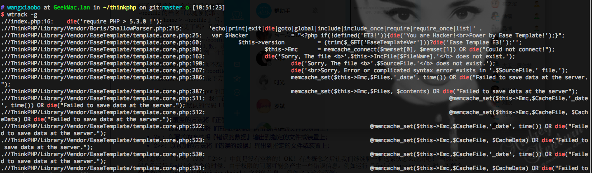

# wtrack

Linux递归查找文件夹下文件中的字符, 据此制作自己的文件中自动追踪命令：`wtrack`

# 原型

```bash
find ./ -type f -name '*.php' |xargs grep --color=auto -n 'session'

```

# 安装

```bash
$ bash install-wtrack

```

# 用法

```bash

$ wtrack -h

++++++++++++++++++++++++++++++++++++++++++++++++++++++++++++++++++++++++++

NAME
	wtrack -- Recursive search characters in files in the specified directory
SYNOPSIS
	 bash wtrack.sh [OPTIONS] search [file-suffix] [dir]
OPTIONS
	 -git check 'echo','print_r','var_dump','die','exit'

++++++++++++++++++++++++++++++++++++++++++++++++++++++++++++++++++++++++++

```

# 搜索

